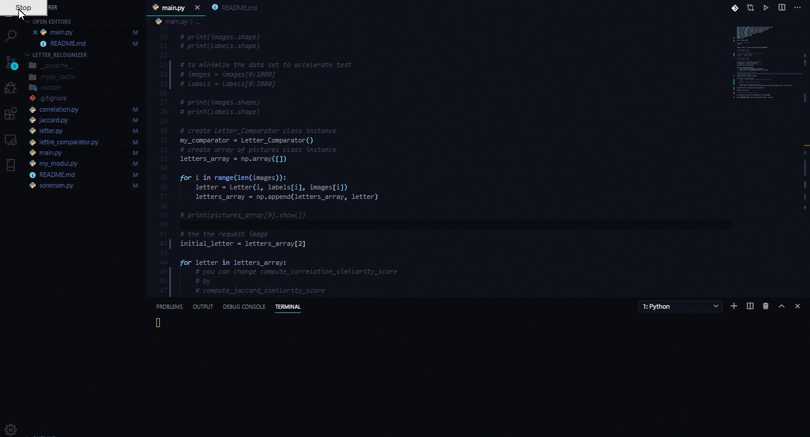

# Digit Recognizer Using MNIST Dataset


## EMNIST
Extended MNIST - Python Package


### The EMNIST Dataset
The EMNIST Dataset is an extension to the original MNIST dataset to also include letters. For more details, see the [EMNIST web page](https://www.nist.gov/itl/products-and-services/emnist-dataset) and the [paper](https://arxiv.org/abs/1702.05373) associated with its release :<br>

Cohen, G., Afshar, S., Tapson, J., & van Schaik, A. (2017). EMNIST: an extension of MNIST to handwritten letters. Retrieved from [here](http://arxiv.org/abs/1702.05373)


### The EMNIST Python Package
This package is a convenience wrapper around the EMNIST Dataset. The package provides functionality to automatically download and cache the dataset, and to load it as numpy arrays, minimizing the boilerplate necessary to make use of the dataset. (NOTE: The author of the Python package is not affiliated in any way with the authors of the dataset and the associated paper.)


### Requirements
- Python 3.7 64bit


### Installation
To install the EMNIST Python package along with its dependencies, run the following command :<br>
```
pip install emnist
```

The dataset it self is automatically downloaded and cached when needed. To preemptively download the data and avoid a delay later during the execution of your program, execute the following command after installation :<br>
```
python -c "import emnist; emnist.ensure_cached_data()"
```

Alternately, if you have already downloaded the original IDX-formatted dataset from the EMNIST web page, copy or move it to ```~/.cache/emnist/```, where ```~``` is your home folder, and rename it from ```gzip.zip``` to ```emnist.zip```. The package will use the existing file rather than downloading it again.<br>

- Get the package from PyPi :
- All requirement that you will need its exist in ``requirements.txt`` so you just need to run this command :

```
!pip install -r requirements.txt
```


### Test
Congratulation.

#### For Script Version
- Open the ```letter_recognizer_scripte/main.py``` and edit it as you want.<br><br>


#### For Notebook Version
- Open the notebook ```letter_recognizer_notebook/main.ipynb``` and edit it as you want.<br/>
- [main.ipynb](letter_recognizer_notebook/main.ipynb)


## Authors
* **[El Houcine ES SANHAJI](https://essanhaji.github.io)** - *Initial work* - [essanhaji](https://github.com/essanhaji)


## Thank you.
